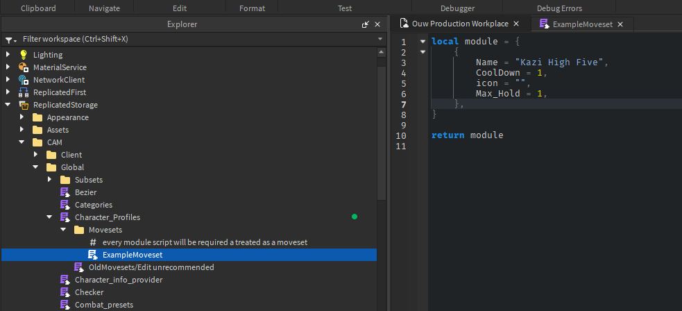
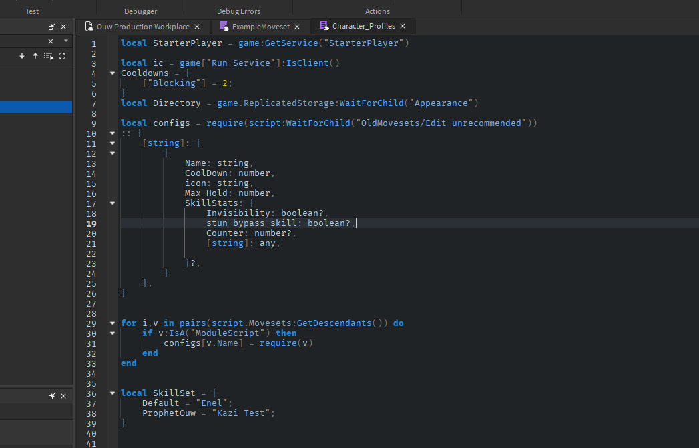
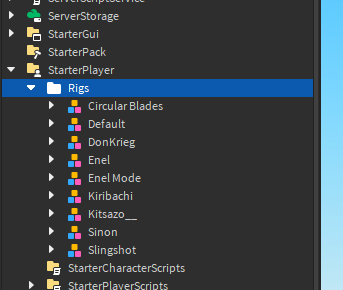
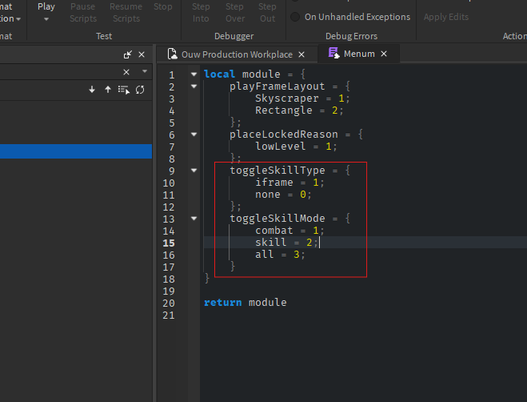
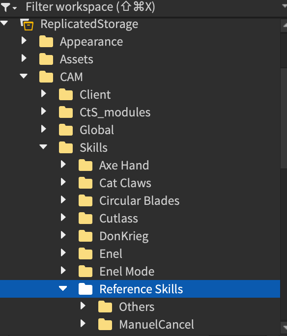

#Skill backend framework/Skill articulation
## Reminders
 - **IF YOU ARE TO RESKIN ANY SKILL YOU MUST TAKE THEM FROM THE MAIN PLACES, NOT THE DEV PLACES**.
 - There is free admin in studio, the prefix for it is double tap `;`.
 - Pressing E on ur keyboard stuns you and this should trigger skill canceling, you can use this to test canceling for skills.
 - Q + A,W,S, or D to dash, this can also help you test skill behaviour.
 - Sound volume should range from 50 to 250, if you're not sure a safe number is 200.
##Getting Skills Ready
 Search “Character_Profiles” in the search bar, this module lets you add skills in so that they can work on the framework.
<figure markdown="span">
{ width="100%" align="left"}
</figure>
Once you open this module, it should look something like this
<figure markdown="span">
{ width="100%" align="left"}
</figure>
This is how the skill sets/movesets are set up. If you are to add your own moveset you'd add the following dicitonary element in the "configs" table
```lua title="Within Character_Profiles module"
["Example Moveset"] = {
		{
			Name = "Skill 2";
			CoolDown = 1;
			icon = "not important/leave blnak";
			Max_Hold = 4;
			Skill_Stats = { --important later/delete if you are copying this from the doc
				Invisibility = true;
				stun_bypass_skill = true;
			}
		};
		{
			Name = "Skill 2";
			CoolDown = 1;
			icon = "not important/leave blank";
			Max_Hold = 3;
			Skill_Stats = { --important later/delete if you are copying this from the doc
				Invisibility = true;
				Counter = 2;
			}
		};
}
```
!!!info "Skills_Stats"
    Ignore Skill_Stats right now, it will help us with important backend modules/skill behaviour later.
To equip said moveset to be tested you change the default index in the skillset variable within the character_profile module to correspond with the moveset index(or module name), you can also set it to be unique to you by making the index your username.
<figure markdown="span">
{ width="100%" align="left"}
</figure>
After that the skills should now be in the framework and ready to be tested/used.
##Custom characters/weapons for movesets
You can also use custom starter characters for movesets, just rename the animation rig to the index of the moveset and parent it into the folder below...
<figure markdown="span">
{ width="100%" align="left"}
</figure>
##Setting up skills modules
 All of the skills come with a pair of modules, one for the client and the other for the server, these modules are parented within the "Skills" folder within game.ReplicatedStorage.Cam
<figure markdown="span">
{ width="75%" align="left"}
</figure>
As you can see, there exists child folders within the “Skills” folder, the system does not take the folders into account, it uses GetDescendants() to get all the module scripts, therefor you can nest folder within folder, module within module, it does not matter. For skills to work there must exist two module scripts, you will copy past the “Template” and “TemplateServer” modules and name them according to the skill name. “Template” becomes “[insert skill name]”, this is the client module. “TemplateServer” becomes “[insert skill name]Server”, this is the server module.The template scripts contain all the functions that get called by the skill framework, the ones commented out are not mandatory. The other ones that are not commented out(Hold,Unhold, and Cancel) are mandatory unless stated otherwise. The following code shows the contents of the client module
```lua title="Within client script"
local module = {Id = 0}
function module:Hold(plr,mouseposition)
	print("hold block for ",plr)
end
function module:UnHold(plr,mouseposition)
	print("Unhold for ",plr.Name)
end
function module:Cancel(plr,mouseposition)
	print("Cancel block for ",plr.Name)
end


--[[ -- Optional. runs after the skill has been ran on the server
function module:After_Server_Hold_Signal(plr)
	
end
function module:Toggle(plr,mouseposition,counterie) --toggle skill(Uses RS>Cam>Global>Subsets>Gameplay>SkillPassiveToggleSignal)
	print("client tog")
end
function module:After_Server_Unhold_Signal(plr)

end
function module:After_Server_Cancel_Signal(plr)

end
function module:After_Server_Counter_Signal(plr)

end

function module:Counter(plr,mouseposition,counterie) --counter skill(Uses skill stats)
end
function module:Switch(plr) -- player flip switch function(Uses RS>Cam>Global>Subsets>Gameplay>Skill_Switch_Adder)

end

]]
return module
```
The id variable within the module, changes everytime the state of the skill changes, so it's different when the skill is held,unheld, or canceld. You can use that id to do some important checks in the Hold function. The following is the code within the server module
```lua title="Within the server module for skill"
local module = {Id = {}}
function module:Hold(plr,mouseposition)
	print("hold block for ",plr)
end
function module:UnHold(plr,mouseposition)
	print("Unhold for ",plr.Name)
end
function module:Cancel(plr,mouseposition,HitHoldLimit)
	print("Cancel block for ",plr.Name)
end

--[[-- Optional. runs after the skill has been ran on the server
function module:Switch(plr) --player switch function

end
function module:Toggle(plr) --toggle function --dodging etc
	print(plr.Name," dodge")
end
function module:Counter(plr,mouseposition,counterie) --counter skill
end
]]
return module
```
As you can see here, the Id variable's value is a table instead of a numeric value. This is because multiple players use the same module on the server, so to get the Id for a specific player you'd get it like this:
```lua
local Id = module.Id[plr]
```
**The server and client skill module will be ran simultaneously by the framework**
!!!note "Everything will be explained later"
    I know i haven't shown a way to continiously get the mouseposition, nor have i explained the functions that are commented out, those will be explained later in this page.
##Some Do's and Don'ts in the client module
 - You **can** create bodymovers on the client, as long as they are deleted in the Unhold or Cancel function. But if the bodymover propells the character up or down, it is recommended that you do that using the updrafting functions.
 - You **can** loop in the client modules, but the loop must have an end condition
 - You **Can't** fire or receive signals from remote events or remote functions within the client effects modules(There is another way to achieve server/client communication, this will be shown later)
 - You **can** require and use any module that is available to the client as long as recursion doesn't happen
##Some Do's and Don'ts in the server module
 - You **can't** create bodymovers for the player on the server, there are certain modules that will allow you to do knockbacks, updrafting,etc.
 - You **can't** receive or fire remote events or remote functions(There are exists a specific way to achieve server/client communication)
 - You **can** add body movers in victims as long as it lasts as long as their stun, if it's a body mover with the goal of changing their Y position somehow, use the updrafting functions which will be showcased later
##Sending signals to client to perform skill effects
###From server
```lua
game.ReplicatedStorage.Communication.SnC.Effects.RE:FireAllClients("effect module name",param1,param2,...,paramn)
```
or
```lua
game.ReplicatedStorage.Communication.SnC.Effects.RE:FireClient(plr,"effect module name",param1,param2,...,paramn)
```
The "RE" stands for "Remote Event" you can switch out to "RF" which stands for "remote function", this will tell the client to fire the modules created in the front-end framework
###From client
```lua
game.ReplicatedStorage.Communication.CnC.ClientEffects:Fire("effect module name",param1,param2,...,paramn)
```
##Preventing 2 players hitting each other at once(Hit priority handler)
```lua
local hit_priority_handler = game.ServerStorage:WaitForChild("SAM"):WaitForChild("Game_Play"):WaitForChild("hit_priority_handler")
--assume some victimvalues,and playervalues variables exist.
local initiated = hit_priority_handler:New(script) --initiates the hit priority for the script

initiated:Exists(victimvalues,"choosing") --checks if a value named "choosing exists in the victim values

initiated:Add(plrvalues,"choosing",.1) --adds a value in the playervalues folder for .1 seconds, this value grants an iframe like behaviour for skills that do the "Exists" check.

initiated:Both(vicvalues,_settings: {lifetime: constant , name: string,add: boolean})

--Example use case:
for i,v in pairs(models) do
   if hit_priority_handler.Both(vicvalues,{pv = plrvalues,name = "Choosing_1"}) == true then continue end;
   --v has no priority since the "Choosing_1" value does not exist inside of vicvalues
end

```
The initiated.Both(...) function first checks if the value exists in the victim , if it does then, it returns true letting the script know that the victim/target has priority, if it doesn't exist then it adds the value into _settings.pv(if it hasn't already been added)which is the player  folder, letting every other attacker know that the player has priority.
!!!Success "The importance of this procedure/module"
	This module prevents players hitting each other at once, which helps the combat feel good. It is mandatory in most if not all skills

##Forcing a skill action(Hold,Unhold,Cancel)
 Hold Will only work if there are no other skills being held, and will work like a tap. unHold and Cancel will only work if said skill is being held.
```lua title="Some server script"
game.ReplicatedStorage.Communication.SnC.Effects.RE:FireClient(plr,"force_skill_actions_server","skillname(Case sensitive)","Cancel",cooldown: boolean, replicate: boolean)
--cooldown helps you control wether or not the skill will have a cooldown. It is recommended to just leave this blank
--replicate param helps you control wether or not the action gets replicated to the server, this is recommended to be left blank as well, in which case it would replicate to the server, this is so you woudn't have to do any special measures on the server like setting the ids manuelly/
```
As you can see this uses the same remote i use to fire effects to play. The frontend skill effects framework is not limited to skill effects.
###Use case
 Lets say you made a rasengan skill, it's a tap to activate, then you will add a loop that will run for a couple of seconds so that the "Hold" state stays on the client, u want the hold to be terminated if the player is stunned or if the timer runs out on the server, if you want to tell/force the client to unhold the skill you'd fire this.
##Getting player mouse position on the client
This is for getting an updated mouse position in a loop of some kind as the mouse position is already sent in the parameter
```lua title="Some client script"
local ph = require(game.ReplicatedStorage:WaitForChild("CAM"):WaitForChild("Client"):WaitForChild("Controllers"):WaitForChild("Platform_Handler"))

local mouse_pos = ph:mousepos(max depth(Optional))
```
##Getting mouse position on the server
This is tricky because it uses both the server and the client module script. It creates a part on the server that the player has network ownership over, Then in the client module, that part's position is updated to the mouse position, since the player has network ownership over it, the position will also be updated on the server.
###Step 1: Creating the part on server script
We can create the part using the following module in the following way
```lua title="Some skill server script"
local SM = require(game.ServerStorage:WaitForChild("SAM"):WaitForChild("Services"):WaitForChild("Server_Mouse_Pos"))

SM:Create_Pos_Part(Character,name of the part,max existence duration)
```
Now we can access the part on both server or client with
```lua
local PP = character:FindFirstChild("PosPart".. name of the part .."Server")
print(PP.Position)
```
###Step 2: Updating the part's position on client
To update it on the client you'd run the following code in a loop
```lua
local PP = character:FindFirstChild("PosPart".. name of the part .."Server")
if PP ~= nil then
    PP.Position = mouse_pos
    PP.bp.Position = mouse_pos
    --i have a alignposition in it, i set the align position(PP.bp.Position) after setting the position of the part just to be safe, because body movers always replicate
end
```
###Step 3: Deleting the part
You can either let the duration run out, and the part auto deletes itself or delete it yourself by running
```lua
local SM = require(game.ServerStorage:WaitForChild("SAM"):WaitForChild("Services"):WaitForChild("Server_Mouse_Pos"))
SM:Delete_Pos_Part(Character,name of the part)
```
##Projectile skills guide
Projectiles are done using shape casting or touched, up to you. You would create an invisible projectile on the server, then on the client do the same exact calculations, with same velocities, and starting position, but this time it will be the actual projectile. When a hit is registered on the client, all it will do is play the collision effect, on the server you will cast a hitbox when the invisible projectile's collision is registered. **YOU MAY DO THIS YOUR OWN WAY, BUT U MUST ALWAYS INCLUDE THE METHOD BELOW WITH PROJECTILES(Checker module method).**
!!!Note "Important note"
	If you're using touched, raycasting, or shapecasting to register a projectile collision, if that collision belongs to a Humanoid, make sure you check if that humanoid is available by using the checker module, if the return isn't nil then u can register the collision. **This must be done in both client(Subjective) and server collisions**
```lua
local results = workspace:Blockcast(CFF,newBird.Size * 1.35,newBird.CFrame.LookVector*20,hitParams)
if results ~= nil and results.Instance ~= nil then
	hit = results.Instance
	
	local distance = (results.Position - newBird.Position).Magnitude
	Intersect = CFrame.lookAlong(newBird.Position + newBird.CFrame.LookVector * (distance - newBird.Size.Z * 0.5), newBird.CFrame.LookVector)
end
if hit ~= nil then
	local victim = Utility:find_character_from_descendant(hit) -- does a couple repetitions until it gets to a humanoid from the child
	if victim == nil then return/continue end;
	if victim and victim == character then return/continue end;tring) ->
	--** IMPORTANT
	if checker:check_victim(script.Parent:GetFullName(),character,victim) == nil then return/continue end;
	--**
end
```
##Debris module / deleting / destroying
I have a custom module that replaces debris and acts as a destroyer
```lua
local DebrisModule = require(game.ReplicatedStorage:WaitForChild("CAM"):WaitForChild("DebrisModule"))
DebrisModule:AddItem(item,duration)
```
Here's the source code for the module for you to use, do not add this code into any of the effects module or skill modules(require it instead). I already have this module.
```lua
local mod = {
  Debris = {}
}
function mod:Clean(item)
    if mod.Debris[item] then
        task.cancel(mod.Debris[item])
    end
end
function mod:AddItem(item,duration)
    if item == nil then return end;
    self:Clean(item)
    self.Debris[item] = task.delay(duration or 5,function()
        if item ~= nil then
            item:Destroy()
        end
    end)
end
return mod
```
## Timed server/client skill communication portal
I have created a module, that lets u create a server client communication portal that lasts a set duration, this could be used during skills, it can also remove some purpose from the force skill action mechanic. The portal must be created on the server in the following manner
```lua title="Some server script"
local ServerClientLink = require(game.ReplicatedStorage:WaitForChild("CAM"):WaitForChild("Global"):WaitForChild("ServerClientLink"))
local Event,Send,Remove = ServerClientLink:New(plr,string: conneciton name,int: connection duration)
Event:Connect(function(param1,param2,...,paramn)
    --do something with the signal received from the client
end)
Send(param1,param2,...,paramn) --send signal to client
task.wait(5)
Remove() --delete the signal, this will automatically be done after the duration
```
!!!Note "Note"
    The "Remove" variable is only available on the server
On the client
```lua title="Some client script"
local ServerClientLink = require(game.ReplicatedStorage:WaitForChild("CAM"):WaitForChild("Global"):WaitForChild("ServerClientLink"))
local Event,Send = ServerClientLink:Connect(String: conneciton name, int: conneciton duration)
Event:Connect(function(param1,param2,...,paramn)
    --do something with the signal received from server
end)
Send(param1,param2,...,paramn) -- send signal to server
```
!!!Note "Note"
    You should check if Event and Send exist on the client prior to using them, incase the connection is unsuccessful
You can also remove a connection by name(Only on server)
```lua title="Some script on the server"
local ServerClientLink = require(game.ReplicatedStorage:WaitForChild("CAM"):WaitForChild("Global"):WaitForChild("ServerClientLink"))
ServerClientLink:RemoveLink(plr,String: connection name)
```
##Skill Stats
Some skills will have some properties, such as iframes, counter,etc. If we go back to the "Getting skills ready" header we can now put this to use
```lua title="In Character_Profiles"
["Example Moveset"] = {
        {
            Name = "Skill 2";
            CoolDown = 1;
            icon = "not important/leave blnak";
            Max_Hold = 4;
            Skill_Stats = {
                Invisibility = true;
                stun_bypass_skill = true;
            }
        };
        {
            Name = "Skill 2";
            CoolDown = 1;
            icon = "not important/leave blank";
            Max_Hold = 3;
            Skill_Stats = {
                Invisibility = true;
                Counter = 2;
            }
        };
}
```
Here are description of some skill stats
```lua
--[[current properties
    Cancel_Bypass=true --makes it so the skill can't be canceld when stunned,ragdolled,etc
   
   stun_bypass_skill=true --makes it so you can perform the skill while being stunned
    skills_to_play_over = {} --list skills that this will play over no matter what
    
   iframe = can be any value as long as it exists

   invisibility= can be any value as long as it exists, turns character invisible and undetecctable
    
   Block_Pierce --this is read only, notifies skill stats that this skill ignores block but does not damage while blocking
   
   Strict_Stun --gives the skill a strict stun meaning victims are disabled from doing anything, regular stun has some exceptions, strict stun doesn't.
   
   Counter = 1,2,3 -- 1 = combat, 2 = everything, 3 = skills only
  
   transparent = can be any value as long as it exists, turns the character invisible but it can be detected by npcs,etc.
]]
```
!!!Note "Important"
    I use string.lower on all of these, so wether u write stuff in upper or lower case is irrelevant.
##Counter skills
You setup a counter by having the property "Counter" in its skill stats
```lua title="In Character_Profiles"
["Example Moveset"] = {
        {
            Name = "counter skill";
            CoolDown = 1;
            icon = "not important/leave blank";
            Max_Hold = 3;
            Skill_Stats = {
                Counter = 2;
            }
        };
}
```
Then when the counter is trigured, the "Counter" function in both the server and client module of the skill, will be fired with the expected parameters.
##Creating remote controlled skills
Skills that u initiate and then toggle later, like a landmine skill that u can explode later.
```lua title="Some server skill module"
local skill_switch = require(game.ReplicatedStorage:WaitForChild("CAM"):WaitForChild("Global"):WaitForChild("Subsets"):WaitForChild("Gameplay"):WaitForChild("Skill_Switch_Adder"))
skill_switch:Add(plr, switch name, Duration(Optional?))
```
This will create a noticeable effect on the button icon, when that button is pressed again the "Switch" function will be fired on the server and client module. If duration is not specified, it will assume a default value.
##Skill passive toggling
Used for more than one toggling of the skill, triggered by different cases but not controlled by the player. This can be used if a skill activates a certain amount of dodges like ken haki.
```lua title="Some server skill module"
local PassiveToggleSignal = require(game.ReplicatedStorage:WaitForChild("CAM"):WaitForChild("Global"):WaitForChild("Subsets"):WaitForChild("Gameplay"):WaitForChild("SkillPassiveToggleSignal"))

PassiveToggleSignal:New(character,skillname,setting: {int: Duration(Optional?),int(Optional?): Type})
```
Here are the types of passive toggling
<figure markdown="span">
{ width="100%" align="left"}
</figure>
I use the "Menum" medoule because i like it,but it is optional you can just pass the corresponding numeric  instead. When the skills are triggered the "Toggle" function within the client and server skill scripts will be fired. If duration is not specified, it will assume a default value.
##A signaler for canceling(Not limited to skills framework)
Skills are only cancelable while the hold state is running, if the unhold or cancel state is being ran, then the skill is considered ran and can not be canceld or unheld anymore, so when we have yields in our cancel or unhold functions, we use the ManuelCancel module to pick up canceling signals.
```lua title="In Some server or client script"

local cancelsignal,canceldestroy = manuelCancel:New(character,int: duration(Optional))
cancelsignal:Connect(function()
    --do something
end)
task.wait(pos1)
canceldestroy()
```
If duration is not specified, it will assume a default value. calling the canceldestroy variable is optional, it is automatically called after the duration is completed
!!!Note "Note"
    this module can be ran outside of the skill framework, and can be ran on both the client and server.
##Casting a hitbox
You can cast a hitbox using one of the functions in the utility module
```lua title="Some script"
--< casting the hit box
local Models = Utility:GetModelInRegion(CFrame: cf,vector3: Size,string: custom tag name(Optional),max parts(Optional))
--<using the models captured
for i,v in pairs(Models) do
   do
        if v ~=character and v:FindFirstChild("Humanoid") ~= nil then
            local vicroot,vhum = v:FindFirstChild("HumanoidRootPart"),v:FindFirstChild("Humanoid")
        end
    end
end
```
There is also a hitbox casting function that does most of the work for you, it wraps the GetModelInRegion function.
```lua
local hitDetected = function(target: Model, target, targetState: 'Blocking' | 'Perfect' | true)
	local targetHumanoid = target:FindFirstChild('Humanoid') :: Humanoid
	local targetRoot = targetHumanoid.RootPart :: BasePart
	--
	local targetAnimator = targetHumanoid:FindFirstChild('Animator')
	
	if targetState == 'Perfect' then
		combatUtility:Perfect(script:GetFullName(), character, target)
	elseif targetState == 'Blocking' then
		combatUtility:Block(script:GetFullName(), character, target, BLOCK_DAMAGE)
	elseif targetState == true then
		
	end
end

--
utility:CreateHitbox({
	caster = character,
	
	hitboxSize = HITBOX_SIZE, --size
	hitboxCFrame = goal, --center
	
	hitPriorityHandler = {callback = hitPriorityHandler.Both, data = { pv = characterValues, name = 'Choosing_1' }}, --mandatory
	checker = checker, -- checker module
	
	hitDetected = hitDetected --function to fire pe4r target
})
```
It does priority checks, and lets you customize it more so that ur code is cleaner.
##Checking if a captured enemy is damageable
You must use the checker module to check if a captured enemy is damageable
```lua
local checker = require(game.ReplicatedStorage:WaitForChild("CAM"):WaitForChild("Global"):WaitForChild("Checker"))
local result = checker:check_victim(script:GetFullName(),character/caster character,victim)
```
result can either be:

- True: This means everything is good to go
 - Perfect: The caster got perfect blocked
 - Block: The victim is blocking
 - nil: This means do not do anything to the victim

A caster is not expected to damage itself, so when u run this function on the caster themselves, you must add a 4th parameter telling the function to disregard the self damaging iframe otherwise it will always return nil
```lua
local checker = require(game.ReplicatedStorage:WaitForChild("CAM"):WaitForChild("Global"):WaitForChild("Checker"))
local result = checker:check_victim(script:GetFullName(),character/caster character,character/caster character,{iframe = true})
```
##Damaging,Stunning etc
These methods are done with the help of the Combat_Util module, that is only available on the server
```lua
local combat_util = require(game.ServerStorage:WaitForChild("SAM"):WaitForChild("Services"):WaitForChild("Combat_Util"));
Combat_Util:Block(script:GetFullName(),character,v,block_remove)
Combat_Util:AddStun(script:GetFullName(),character,vicvalues,1.5)
Combat_Util:RagDoll(script:GetFullName(),character,vicvalues,1.5)
Combat_Util:Damage(script:GetFullName(),character,v,{Base = dmg ,Skill = script.Parent.Name})
--v is the victim
--vicvalues is the values folder for the victim
```
These functions can be used on the caster without other considerations.
!!!Note "Note"
    Values folders are where i store values for the player, npcs,etc. I use values alot to depict states, send signals,etc. It is not part of the skill framework so ignore it for now.
To get the value folder of a player or npc u use the function
```lua

local Utility = require(game.ReplicatedStorage:WaitForChild("CAM"):WaitForChild("Global"):WaitForChild("Utility"))
vicvalues = Utility:getvaluesfolder(plrcharacter or npc/victim character)
```
##Skill Storage
A storage for serversided module scripts for skills, This can only be used on the server as creating unmanaged tables within the server module script for a skill is prohibited.
```lua
local skillStorage = require(game.ServerStorage.SAM.Utility.SkillStorage)
--When u want to access a storage table for a skill
local storageTable = SkillStorage:GetID(plr,skillname)
--Empty the table
local storageTable = SkillStorage:ResetId(plr,skillname)
--When ur done with it
SkillStorage:ClearID(plr, skillname)
```
By default, the skill storage for a skill will be the last parameter on the server functions, the framework will automatically create it for you, This table is unique to the player(Other players can't access it). It is cleared when the player leaves, otherwise you'd have to clean it manuelly. It is available on the Hold, unhold, and cancel function. You may print it to test if it is there, if a table is printed then it is there. **Remember that the second parameter is always the player's mouse position**.
<figure markdown="span">
{ width="100%" align="left"}
</figure>
!!!Warning "Please Remember"
	Special functions like counters and toggles will not always have this at the third parameter. When you are cleaning the table manuelly, you can't set skillstorage = {}, since this is just a reference, when you do this you are referencing it to a new table, You must instead require the SkillStorage module in serverstorage and run :ResetId like it is shown in the code snippet above.
##Getting a skill's status(Last used, or if it's being used)
```lua
local manage_cd = require(game.ServerStorage:WaitForChild("SAM"):WaitForChild("Game_Play"):WaitForChild("manage_cd"))
local lastUsed,isBeingUsed = manage_cd:skillStatus(plr,string: skill name) 
```
You can use this on remote toggle or passive toggle skills to measure the last time said skill was used.
##The importance of pause gameplay value/function yielding
When the character is not able to do anything(combat,dash,cast skills) this is called "paused gameplay". This happens when the player is holding a skill or when a player unholds a skill and there are yields in the unhold function. When the aren't any yields u can exhibit the same behaviours by adding a value named "pause_gameplay" in the player values, this will ensure that the player is not able to dodge,combat,etc while a sequence of event is still happening in the unhold function.
```lua title="Example"
local plrvalues = Utility:getvaluesfolder(character)
local pause_gameplay = Instance.new("BoolValue")
pause_gameplay.Name = "pause_gameplay"
pause_gameplay.Parent = plrvalues
DebrisModule:AddItem(pause_gameplay,1.4)

--or
local Utility = require(game.ReplicatedStorage:WaitForChild("Cam"):WaitForChild("Global"):WaitForChild("Utility))
Utility:AddValue(parent: Instance, name: string, duration: number)
```
##More helpful values
###skillslow value
This value sets the player's walkspeed to 4.
```lua
local DebrisModule = require(game.ReplicatedStorage:WaitForChild("CAM"):WaitForChild("DebrisModule"))
local Utility = require(game.ReplicatedStorage:WaitForChild("CAM"):WaitForChild("Global"):WaitForChild("Utility"))
plrv = Utility:getvaluesfolder(plrcharacter or npc/victim character)
local skils = Instance.new("BooleanValue")
skils.Name = "skillslow"
skils.Parent = plrv
DebrisModule:AddItem(skils,2)

--or
local Utility = require(game.ReplicatedStorage:WaitForChild("Cam"):WaitForChild("Global"):WaitForChild("Utility))
Utility:AddValue(parent: Instance, name: string, duration: number)
```
###skill_stand_still value
This value sets the player's walkspeed to 0.
```lua
local DebrisModule = require(game.ReplicatedStorage:WaitForChild("CAM"):WaitForChild("DebrisModule"))
local Utility = require(game.ReplicatedStorage:WaitForChild("CAM"):WaitForChild("Global"):WaitForChild("Utility"))
plrv = Utility:getvaluesfolder(plrcharacter or npc/victim character)
local skill_stand_still = Instance.new("BooleanValue")
skill_stand_still.Name = "skill_stand_still"
skill_stand_still.Parent = plrv
DebrisModule:AddItem(skill_stand_still,2)

--or
local Utility = require(game.ReplicatedStorage:WaitForChild("Cam"):WaitForChild("Global"):WaitForChild("Utility))
Utility:AddValue(parent: Instance, name: string, duration: number)
```
###NOMouvementlines value
This value disables the movement lines.
```lua
local DebrisModule = require(game.ReplicatedStorage:WaitForChild("CAM"):WaitForChild("DebrisModule"))
local Utility = require(game.ReplicatedStorage:WaitForChild("CAM"):WaitForChild("Global"):WaitForChild("Utility"))
plrv = Utility:getvaluesfolder(plrcharacter or npc/victim character)
local NOMouvementlines = Instance.new("BooleanValue")
NOMouvementlines.Name = "NOMouvementlines"
NOMouvementlines.Parent = plrv
DebrisModule:AddItem(NOMouvementlines,2)

--or
local Utility = require(game.ReplicatedStorage:WaitForChild("Cam"):WaitForChild("Global"):WaitForChild("Utility))
Utility:AddValue(parent: Instance, name: string, duration: number)
```
###NR value / disable auto rotate
This value disables auto rotation, so the player's rotation will be locked.
```lua
local DebrisModule = require(game.ReplicatedStorage:WaitForChild("CAM"):WaitForChild("DebrisModule"))
local Utility = require(game.ReplicatedStorage:WaitForChild("CAM"):WaitForChild("Global"):WaitForChild("Utility"))
plrv = Utility:getvaluesfolder(plrcharacter or npc/victim character)
local NR = Instance.new("BooleanValue")
NR.Name = "NR"
NR.Parent = plrv
DebrisModule:AddItem(NR,2)

--or
local Utility = require(game.ReplicatedStorage:WaitForChild("Cam"):WaitForChild("Global"):WaitForChild("Utility))
Utility:AddValue(parent: Instance, name: string, duration: number)
```
##Updrafting
Many skills will have the ability to propell a player, or a player and the victim being attacked into the air, we use two other functions within Combat_Util to achieve this.
###Updrafting one entity
```lua
local combat_util = require(game.ServerStorage:WaitForChild("SAM"):WaitForChild("Services"):WaitForChild("Combat_Util"));
combat_util:Add_air_combo_bp(character humanoid root part,optional but can not be replaced,custom_y(Optional),startpos(Optional/X and Z are ignored))
--startpos is the ground position
--customy is the distance from the ground
```
The reason why the second parameter is optional and must exist, is because it is required when updrafting two entities, the function that updrafts two entities uses this function. So its space must be regarded. Set it to the caster's humanoid root part for the target's network owner to be set to the caster if it is not a player.
###Updrafting two entities
```lua
local combat_util = require(game.ServerStorage:WaitForChild("SAM"):WaitForChild("Services"):WaitForChild("Combat_Util"));
combat_util:Air_combo_up(caster character,victim character)
```
This does a regular updraft on the caster character and victim character, it is used in combat, and many existing skills.
##Cutscene skills
Since not every cutscene skills will be casted similarly i will only explain the process of after it connects.

- Get the cframe of where it connected.
- Cast a hitbox(If necessary) and loop through all the captured victims
- Create invisible anchored parts that will be cframed according to the animation in which you will weld the caster and the victim, they must be on two or more seperate parts that respect the animation initial positioning. Each entity/target will have its own part so that when one dies they don't all die.
- Make sure you aren't creating the caster's anchored part within the loops,if you do, then add sanity checks to make sure it only creates one part
- Add Stuns,iframes,pause_gameplay values that'll last the length of the cutscene, you will give them max existence duration and delete them when necessary.
- Play the animaiton for both the caster and the victim
- Get the camera rig, play animation on it, then use the camera module to stick the player and victim's cameras to the animaiton rig
```lua
local cutscene_handler = require(game.ServerStorage:WaitForChild("SAM"):WaitForChild("Game_Play"):WaitForChild("Cutscene_camera_handler"))
if Cam == nil then
    Cam = script.CameraRig:Clone()
    Cam:PivotTo(root.CFrame)
    Cam.Parent = workspace.Debree
    Cam.RootPart.RootPart.Part0 = root
    game.Debris:AddItem(Cam,1.73)
    Cam.AnimationController.Animator:LoadAnimation(script.glock_cam_thing):Play()
    do
        cutscene_handler:Regular(plr,Cam.Bone)
    end
end
if Cam ~= nil then
    --getting the victim if its a player so that we can play the camera animation to it too
    local pr = game.Players:GetPlayerFromCharacter(v)
    if pr then
        cutscene_handler:Regular(pr,Cam.Bone)
    end
end
```
!!!Note "Note"
    I will provide a ton of skill examples, don't worry... After reading the doc, you will understand the skill code easily.
##Long dash skills
These are done by running a hitbox on the server continiously, then when the hitbox finally hits something, you force the skill to be unheld, then remove or tween the body movers on client to stop while doing a capture action on the server. Most of the time the dash can also be stopped by the player unhold the skill.
##Reference skills
I have left a folder within game.ReplicatedStorage.Cam.Skills with reference skills, do not reuse or reference any skills that aren't in this folder.
<figure markdown="span">
{ width="100%" align="left"}
</figure>
