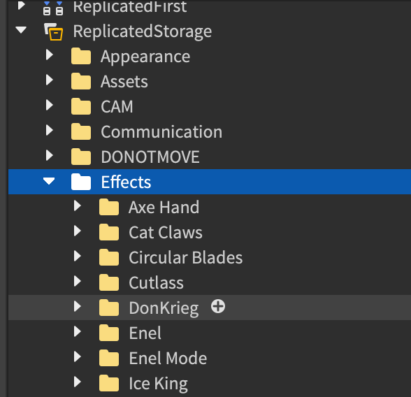
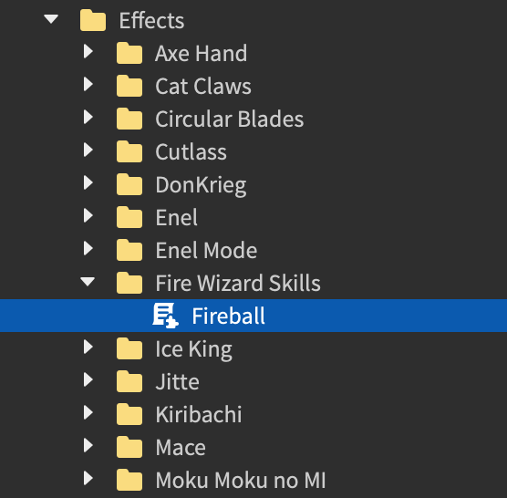
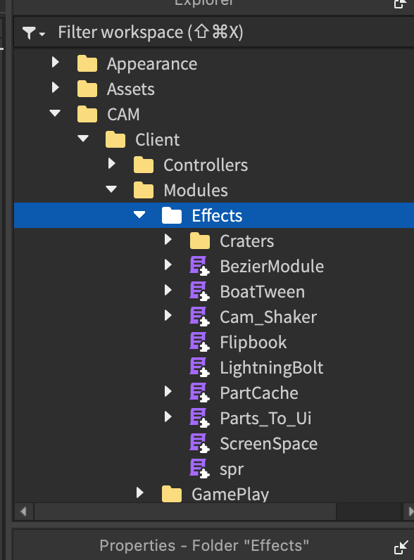

#Front end frame-work
If you're only assignment is to make the frontend for a specific skill or moveset, this is most likely as far as you will need to read.
## Important notes
 - Effect modules should contain effects and only effects, you will not maneuver or do anything with the character in the effects modules, that’s to be done in a separate script.
 - Front end developers must follow the front end layout/instructions listed in this page
 - If you do not have access to the group inventory, you will upload animations/sounds to your own inventory. If you are uploading animations, make sure to leave the keyframe sequence within the animation instance so that we may reupload it to the Ouw productions group.
 - No replacing functions that roblox already provides you for custom ones(Debris, math, etc...)
<figure markdown="span">
{ width="100%" align="left"}
</figure>
 - Make sure the sounds have max distances, if ur not sure what to set it to, Set it to 200.
##Effect modules placement(For Front-ends/Back-ends working with the OP framework)
 Effect modules are to be placed in the folder called "Effets" in replicated storage. Wether you choose to put them in a already existing folder, or create a folder for a new set of skills does not matter and is up to you. But if you are working on a new moveset, it is strongly recommended that you create a new folder for said moveset.
<figure markdown="span">
{ width="50%" align="left"}
</figure>
!!!info "OP framework"
    The acronym "OP" stands for "Ouw Productions"

##Effect module instructions
 The name of the module should correlate with the skill in which it is for.
<figure markdown="span">
{ width="50%" align="left"}
</figure>
!!!question "Does the name require to match the skill name"
    No it does not, this is only to help differentiate it from the other module scripts
###Setup
Each skill module will return a function which will accept necessary parameters. Modules such as the camera shaker or crater module should be required on top of the script.

```lua title="Inside the Fireball effects module"
return function(character,state)
    --do stuff
end)
```
You will have to parent your effects in some folder, if you are working with the OP framework, you will create such folder
```lua title="Creating of the effects debree folder"
local Effects = workspace.Debree:FindFirstChild(game.Players.LocalPlayer.Name.."'s effects debree thing213asdasdasdasd")
if Effects == nil then
	Effects = Instance.new("Folder",workspace.Debree)
	Effects.Name = game.Players.LocalPlayer.Name.."'s effects debree thing213asdasdasdasd"
end
```
If you aren't working with the OP framework, just create some random folder in workspace, name it accordingly, make it so it would be easier for us to replace that instance code block with the one above.
#### Streaming enabled
 This game uses streaming enabled for better performance. This means that you don't send basepart instances within ur parameters to the client module, you have to wait for those parts(with a max wait time) from a model parent(Because models don't get streamed out) and then check if they exist.
```lua title="In Fireball client effect module"
return function(character,state)
    local projectile = character:WaitForChild("ProjectileParentModel",2)
    if projectile == nil then return end;
    projectile = projectile:FindFirstChild("MainPart")
    if projectile == nil then return end; -- this may be repeated at different parts of the code to prevent erroring.

    --do stuff

end)
```
For parts that are within the character that is casting a skill, or that aren't created by the server skill script, you must not use waitforchild for them, you can just directely check if they exist.
```lua title="In Fireball client effect module"
return function(character,state)
    local root = character:FindFirstChild("HumanoidRootPart")
    if root == nil then return end;

    --do stuff

end)
```
#### Effects helpers and utility modules
 Camera shaker, and crater module will be provided to you(None OP framework), these are one of the only modules you shall require within the effects modules.
 If you want to use other modules, for OP framework, check if that module you want already exists in the following folder(Different crater modules are within the "Craters" folder)
<figure markdown="span">
{ width="50%" align="left"}
</figure>
If it does not exist in here and the module is a utility module or has independent functions, you can just copy those functions over to the effects module and use them accordingly. If the funcitons are dependent within the module, and you'd need to copy over the entire module in order to make use of it, you shoud let us know if you are using OP framework and we'll implement it in for you after scanning the module, if you aren't a OP framework user, then just place the module somewhere in replicatedstorage and require it.
!!!note "Note"
    We already have tons of popular modules available within our frameworks(This is only relevant to OP framework users)
#### Distance checking
 Distance checking is really important, because if a player is too far we don’t want to play effects on their client.
```lua title="Within the Fireball effects module"
return function(player,direction)
    --**------------**--
    if (plr.Character.HumanoidRootPart.Position-workspace.CurrentCamera.CFrame.Position).Magnitude >= 250 then return end;
    --**------------**--
end
```
If the skill you’re working on has states you may want to disregard the distance check when a cancel state is fired.
```lua title="Still within the Fireball effects module"
return function(player,state,direction)
	--**------------**--
	if (plr.Character.HumanoidRootPart.Position-workspace.CurrentCamera.CFrame.Position).Magnitude >= 250 and state ~= "cancel" then return end;
	--**------------**--
end
```
!!!note "Note"
    Proper sanity checks to ensure that all the parameters that are needed exist should be done beforehand. if we account for streaming enabled, make sure that instances passed within your parameters are not mandatory to run the cancel state.
####Approach to canceable skill effects
 Although there are many ways a cancelable skill can be done, I prefer this simple approach instead, if you have any suggestions, run them by me first.
!!!Info "Important Info"
    Skills with many states, and no yields may not require a cancelation procedure. If a yield in the effects doesn't last too long, you shall perform the cancel procedure after the duration is completed.
```lua title="Within the Fireball effects module"
return function(player,character,state)
	local itemname = "canceled##"..plr.Name..plr.UserId --make sure the name is unique so that it doesn't cancel for other players
	if state == "Startup" then
		local effects = Instance.new("BoolValue")
		effects.Name = itemname
		effects.Parent = workspace;
		game.debris:AddItem(effects,10) --really important to have a max existence time for the item so that some bug doesn't cause it to stay there forever
	elseif state == "Cancel" then
		local item = workspace:FindFirstChild(itemname)
		if item then
			--[[you might want to disable particles first, then delete the item after some time.
			If you're going to do this, name the item "--" or something that won't cause it to be picked up everytime the cancel state is ran,
			we only want it to be canceled once incase a player performs the skill again while the old item is being canceled]]
			item:Destroy()
		end
	end	
end
```
!!!Question "WHY DO IT LIKE THIS??"
	If you use tables, and other single state methods, this will make it so that if the skill is used multiple times, it only cancels one occurrence.
if you want to make sure it cancels previous effects before any state is ran, you can do this like this(Notice how the cancel code block is ran before any state checks)
```lua title="Within Fireball module"
return function(player,character,state)
	local itemname = "canceled##"..plr.Name..plr.UserId --make sure the name is unique so that it doesn't cancel for other players
	do--<cancel
		local item = workspace:FindFirstChild(itemname)
		if item then
			--[[you might want to disable particles first, then delete the item after some time.
			If you're going to do this, name the item "--" or something that won't cause it to be picked up everytime the cancel state is ran,
			we only want it to be canceled once incase a player performs the skill again while the old item is being canceled]]
			item:Destroy()
		end
	end-->
	if state == "Startup" then
		local effects = Instance.new("BoolValue")
		effects.Name = itemname
		effects.Parent = workspace;
		game.debris:AddItem(effects,10) --really important to have a max existence time for the item so that some bug doesn't cause it to stay there forever
	end	
end
```
!!!Warning "IMPORTANT REMINDER"
    PLEASE KEEP IN MIND THAT NO BODY-MOVERS OR ANY SORT OF MANEUVERING OR MODIFICATION SHALL BE DONE TO THE PLAYER/NPC CHARACTER WITHIN THE EFFECTS MODULES UNLESS STATED OTHERWISE. The effects modules are purely to play effects and nothing else!
